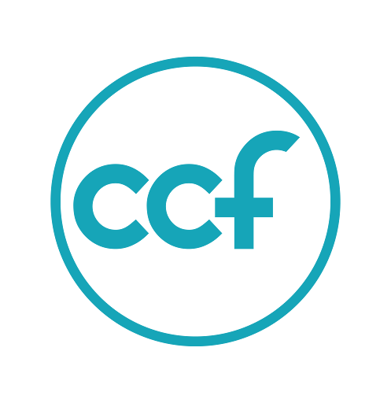

<p align="center">
  
</p>

<h1 align="center">CCF IGDP Backend</h1>
<p align="center">Inter Generational Discipleship Program - Backend Stack</p>
<p align="center">An initiative from volunteers at CCF Tandang Sora</p>

## Description

CCF IGDP Backend is a [NestJS](https://github.com/nestjs/nest) framework application built to support the Inter Generational Discipleship Program (IGDP) at CCF Tandang Sora. This is a community-driven initiative developed by volunteers.

## Project setup

```bash
$ bun install
```

## Compile and run the project

```bash
# development
$ bun run start

# watch mode
$ bun run start:dev

# production mode
$ bun run start:prod
```

## Run tests

```bash
# unit tests
$ bun run test

# e2e tests
$ bun run test:e2e

# test coverage
$ bun run test:cov
```

## License

This project is MIT licensed.
